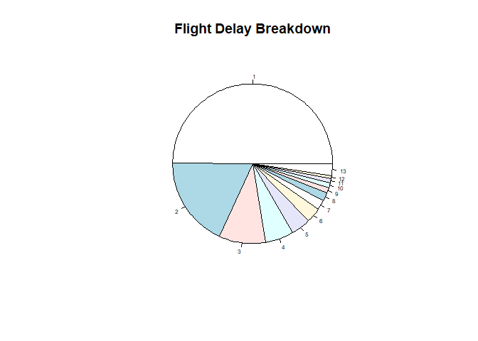
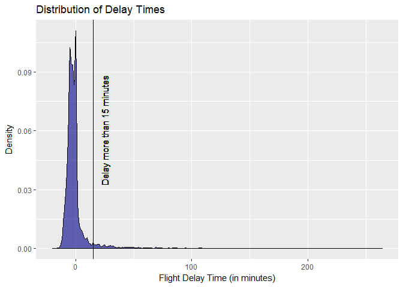
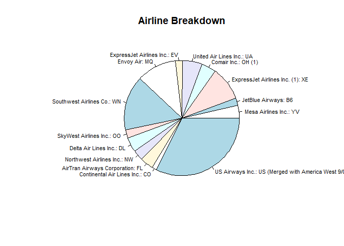

# Flight Delay Prediction at the Pittsburgh Airport
Aldo Marini, Ellie Najewicz, Nidhi Shree, Xin Qiu  

```r
knitr::opts_chunk$set(cache=TRUE)
  fig.path = "README_figs/README-"
```

Introduction:

We build a model to predict if a flight is going to be on time, moderately delayed, or severly delayed. Flight delays impact people's travel plans. Be it a complete re-scheduling of the travel plans, or just waking up some minutes later, we think our customers could use the flight delay information for good. Further, anecdotical experience tells us that airlines are not good in predicting flight delays-or at least not good in communicating it to their customers. So, we aim to provide people, our customers, of actionable flight delay information.

In order to achieve this result, we first explore descriptive trends, then run a variable selection process to select the smallest number of variables with the lowest error rate, and finally choose a model based on customer preferences. We find that a Random Forest performs impressively well-with an accuracy of 99%. Last, to confirm the external validity of our model, we run it on data from 2006. While many things have changed since 2006, we confirm that the model is robust in time. 

Key Tasks: 

This sample was retrieved from the source and run through cleaning. A sample of this data is shown at the end of the Data Overview section

A discussion of which variables are most useful can be seen at the beginning of our Discussion section. An exploration of each variables are completed in the Descriptive Analysis. 

A discussion of a delay predicting application is located in our Discussion section at the bottom of the report. 

A comparison of our model run on the 2006 data is in the External Validity section. 


##Obtaining 2017-16 Data


```r
library(ggplot2)
library(ISLR)
library(MASS)
library(knitr)
library(glmnet)
library(plyr)
library(gam) 
library(dplyr)
library(curl)
library(utils)
library(stringr)
library(lubridate)
library(data.table)
library(randomForest)
library(gbm)
library(caret)
library(glmnet)
library(MASS)
library(klaR)
library(ROCR)

working_directory = "C:/Users/ald0m/Desktop/flight-prediction/"

#import 2016 data
all.flights <- read.csv(paste0(working_directory,"data/","flights.csv"))

carrier <- read.csv(paste0(working_directory,"data/","carrier_list.csv"))
colnames(carrier)[colnames(carrier)=="Description"] <- "AIRLINE_DESC"
delay.group <- read.csv(paste0(working_directory,"data/","delay_groups.csv"))
colnames(delay.group)[colnames(delay.group)=="Description"] <- "DEP_DELAY_GROUP"
distance.group <- read.csv(paste0(working_directory,"data/","L_DISTANCE_GROUP_250.csv"))
colnames(distance.group)[colnames(distance.group)=="Description"] <- "DISTANCE_GROUP"
weekdays <- read.csv(paste0(working_directory,"data/","L_WEEKDAYS.csv"))

#import 2006 data
all.PIT.2006 <- read.csv(paste0(working_directory,"data/","all_PIT_2006.csv"))

#import weather data
weather.2006 <- read.csv(paste0(working_directory,"data/","Pittsburgh_Data_2006.csv"))
weather.2016.17 <- read.csv(paste0(working_directory,"data/","Pittsburgh_Data_2016-17.csv"))

#import holiday data
hols.2016 <- read.csv(paste0(working_directory,"data/","holidays.2016.17.csv"))
hols.2006 <- read.csv(paste0(working_directory,"data/","holidays.2006.csv"))
```


```r
#preparing the holiday table
hols.2016$date <- as.Date(hols.2016$date, format = "%Y-%m-%d")
hols.2006$date <- strptime(as.character(hols.2006$date), "%d-%m-%Y")
hols.2006$date <- as.Date(as.character(hols.2006$date), format = "%Y-%m-%d")
```


```r
#preparing the weather table
weather.2016.17$DATE <- as.Date(weather.2016.17$DATE, format = "%d-%m-%Y")
weather.2006$DATE <- as.Date(weather.2006$DATE, format = "%d-%m-%Y")
```

##Cleaning the 2016 Data
After building the data set, we had to clean the data set. This included common tasks such as putting dates and timestamps in proper format, changing group numbers to a description, and adding external data such as weather and holiday data. We also worked on reducing the rows to only those we need for our analysis and selecting only flights with either PIT as the origin airport or the destination airport. We then made a merge to capture the arrival flight information with the destination flight information. So now we have just a table of flight departures from PIT with their associated arrival flight information. This was an important effort since we wanted to know if the arrival flight was delayed since that would have a crucial impact on whether a flight takes off on time. See below a sample of our final data set: 


```r
kable(head(x))
```


 ORIGIN_AIRPORT_ID  ORIGIN_STATE_ABR   TAIL_NUM   FL_DATE       ARR_DELAY  ARR_TIME    DISTANCE.x   DISTANCE_GROUP.x   DIVERTED.x  AIRLINE_DESC.x                ACTUAL_ELAPSED_TIME   IF_DELAY.x  ARR_TIME_STAMP   DATE_TIME.x            DEST_AIRPORT_ID  DEST_STATE_ABR    MONTH   DEP_DELAY  DEP_TIME    DISTANCE.y   DISTANCE_GROUP.y   DIVERTED.y    AWND   PRCP   TMAX   TMIN   IS_HOLIDAY  AIRLINE_DESC.y                QUARTER   AIRLINE_ID  DEST_CITY_NAME         CANCELLED   IF_DELAY.y  DEP_TIME_STAMP   DATE_TIME.y           FL_DATE.x   FL_DATE.y   transit.time 
------------------  -----------------  ---------  -----------  ----------  ---------  -----------  -----------------  -----------  ---------------------------  --------------------  -----------  ---------------  --------------------  ----------------  ---------------  ------  ----------  ---------  -----------  -----------------  -----------  ------  -----  -----  -----  -----------  ---------------------------  --------  -----------  --------------------  ----------  -----------  ---------------  --------------------  ----------  ----------  -------------
             10693  TN                 N8685B     2017-02-07           -7  1158               462                  2            0  Southwest Airlines Co.: WN                     78            0  11:58:00         2017-02-07 11:58:00              14107  AZ                    2          -8  1247              1814                  8            0   13.42   0.45     65     43            0  Southwest Airlines Co.: WN          1        19393  Phoenix, AZ                    0            0  12:47:00         2017-02-07 12:47:00   NA          NA          NA           
             13232  IL                 N8532S     2017-08-09            7  1557               402                  2            0  Southwest Airlines Co.: WN                     75            0  15:57:00         2017-08-09 15:57:00              11697  FL                    8           4  1639               994                  4            0    3.13   0.00     79     53            0  Southwest Airlines Co.: WN          3        19393  Fort Lauderdale, FL            0            0  16:39:00         2017-08-09 16:39:00   NA          NA          NA           
                NA  NA                 N473WN     2016-12-19           NA  NA                  NA                 NA           NA  NA                                             NA           NA  NA               NA                               15304  FL                   12          -4  0531               873                  4            0    2.68   0.00     27     18            0  Southwest Airlines Co.: WN          4        19393  Tampa, FL                      0            0  05:31:00         2016-12-19 05:31:00   NA          NA          NA           
             12191  TX                 N790SW     2017-05-22          -17  1443              1131                  5            0  Southwest Airlines Co.: WN                    150            0  14:43:00         2017-05-22 14:43:00              15304  FL                    5          -2  1533               873                  4            0    7.83   0.01     66     54            0  Southwest Airlines Co.: WN          2        19393  Tampa, FL                      0            0  15:33:00         2017-05-22 15:33:00   NA          NA          NA           
             12191  TX                 N8665D     2016-12-14           -9  1336              1131                  5            0  Southwest Airlines Co.: WN                    153            0  13:36:00         2016-12-14 13:36:00              12892  CA                   12          -4  1436              2136                  9            0    9.62   0.00     30     18            0  Southwest Airlines Co.: WN          4        19393  Los Angeles, CA                0            0  14:36:00         2016-12-14 14:36:00   NA          NA          NA           
             10397  GA                 N953WN     2016-10-12          -10  1005               526                  3            0  Southwest Airlines Co.: WN                    100            0  10:05:00         2016-10-12 10:05:00              15016  MO                   10           0  1050               554                  3            0    7.61   0.00     73     46            0  Southwest Airlines Co.: WN          4        19393  St. Louis, MO                  0            0  10:50:00         2016-10-12 10:50:00   NA          NA          NA           

In our sample we have 25574 total flights in our data set. Our data ranges from 2016-10-01 to 2017-09-30. 

##Descriptive Analysis

This report looks to predict if a flight will be delayed and if so, to what extent. Thus, it is important to first look at descriptive statistics on the flight delays themselves to guide our hypothesis.Approximately 28.9864706% of these flights were delayed by any amount.

###Flight Delays
First, we will look at the distribution of delays:

<!-- -->
From the density plot we can see that most delays are small delays under 15 minutes late. However, delays have a large variation and can range to over 500 minutes. Note that some of the delays are actually negative - this indicates that a flight actually left early. This shows us that a majority of flights leave a few minutes early or right on time. To better understand the severity of delays we can look at the proportion of delays that are group based on the severity of their delay time.

<!-- -->

This pie chart sheds more light on the distribution of delay times in our data. This confirms that of all flights that are delayed, about 50% of them are under 15 minutes. Then about 25% of the data is between 15 and 45 minutes. Lastly, the final 25% includes delays of 45 minutes or greater. 

We know that flights are delayed for various reasons. The data contains variables that capture the minutes of delay associated with a particular delay reason. The proportion of each delay type that accounts for flight delays in Pittsburgh are shown below: 

<!-- -->

From this bar chart we can estimate that on average a flight's delay time is mostly due to a late aircraft or a carrier-caused delay. Air traffic seems to also make up a large proportion of delays. Whereas weather and security rarely account for delayed flights. Variables that have to do with the carrier, arrival information, and air traffic will be a good predictors of delay time. Since weather is so low as a cause for delay, we might expect seasonality not to be a good predictor of delays.

Even though we will not explicitly use these data attributes later on in the modelling. We will find out that by using proxies for aircraft delays, carriers and weather as predictors, we can get a useful accuracy in predicting delays.

Now we have a good understanding of delays at the Pittsburgh airport, we can begin to look at some of the other variables and their relationship with flight delays.

###Seasonality and delays

Addressing seasonality, we will look at delays broken down by quarters. Below see a scatter plot that shows a scatter plot of quarter and length of delays. We also tried plotting the months, and there were no visible trends.

<!-- -->

<!-- -->

There does not not appear to be any major trends identified when looking at seasonal trends. Delays seem to increase in frequency and severity during the spring and the holidays. This could be because of increased air traffic or weather. 

###Airline Carriers and Delays

Now we can try to identify if there are significant differences in delays for different airline carriers. The following plot presents all airlines in our sample. 

<!-- -->

Airline                         Mean Delay Time   Standard Deviation Delay Time
-----------------------------  ----------------  ------------------------------
ExpressJet Airlines Inc.: EV           82.49361                       136.75321
SkyWest Airlines Inc.: OO              48.26343                        90.08796
Spirit Air Lines: NK                   45.39053                        49.09649
JetBlue Airways: B6                    44.80085                        54.13472
Frontier Airlines Inc.: F9             42.38281                        78.46679
American Airlines Inc.: AA             35.70776                        66.94533
United Air Lines Inc.: UA              31.62757                        59.31342
Delta Air Lines Inc.: DL               26.82261                        60.97068
Southwest Airlines Co.: WN             24.02446                        40.18438

It seams that southwest is the most popular airline at the PIT airport, along with lots of flights from American Airlines and Delta. Also the most delayed flights tend to be from Express Jet, SkyWest, and Spirit Air. This trend could be because of smaller samples.

<!-- -->

The bar graph above shows how many delayed flights are accounted for in each airline. South West has a very high proportion of delayed flights as does Express airlines, Frontier, and JetBlue. From this analysis, the type of airline might have an effect on if a flight is delayed. 

###Destination and Delay times


```r
library(fiftystater)
#code from https://cran.r-project.org/web/packages/fiftystater/vignettes/fiftystater.html 
ggplot(state.group, aes(map_id = tolower(V1))) + 
  # map points to the fifty_states shape data
  geom_map(aes(fill = count), map = fifty_states) + 
  expand_limits(x = fifty_states$long, y = fifty_states$lat) +
  coord_map() +
  scale_x_continuous(breaks = NULL) + 
  scale_y_continuous(breaks = NULL) +
  labs(x = "", y = "") +
  theme(legend.position = "bottom") + scale_fill_gradient(low="blue", high="red")

kable(subset(state.group[,c(1,5,6)], !is.na(state.group$delay.mean)),row.names = FALSE ,col.names = c("State", "Mean Delay Time","Standard Deviation Delay Time"))
```

From this we can see that most flights are going to Georgia, Florida, and Illinois. The states with the most delayed flights come from New York, Pennsylvanian, and North Carolina. The variance of delay times by state are very large. It is uncertain if destination state will be an influential factor in our model. Note: the Standard deviation for Missouri is NA because there is only one flight in our sample.  

We can do this same analysis for cities and see if we get similar results:

City                     Mean Delay Time   Standard Deviation Delay Time
----------------------  ----------------  ------------------------------
Phoenix, AZ                     36.94203                             268
Los Angeles, CA                 34.94900                             167
San Francisco, CA               27.92235                              95
Denver, CO                      62.99383                             366
Fort Lauderdale, FL             46.71878                             214
Fort Myers, FL                  55.01958                             114
Orlando, FL                     50.74640                             558
Tampa, FL                       60.01728                             295
Atlanta, GA                     58.99543                             947
Chicago, IL                     57.98519                             925
New Orleans, LA                 21.24012                               8
Boston, MA                      52.72360                             421
Baltimore, MD                   26.99852                             310
Detroit, MI                     47.39308                             186
Minneapolis, MN                112.69684                             198
St. Louis, MO                   39.89682                             110
Charlotte, NC                   54.35734                             370
Newark, NJ                      59.83127                              15
Las Vegas, NV                   44.03817                             374
New York, NY                   138.85386                             324
Philadelphia, PA                63.71654                             223
Myrtle Beach, SC                38.23693                              22
Nashville, TN                   29.52602                             182
Dallas, TX                      42.33852                             156
Dallas/Fort Worth, TX           80.79922                             396
Houston, TX                     76.82041                             169

When we looking at cities we see similar trends. New York City, Philadelphia, and Minneapolis tend to have the worst delays. Overall, we do not see striking trends in the data regarding destination city, it seems that state may be a better variable to include in our model than city. 

###A Note on Cancelations

While Cancellations are not what we are measuring in this analysis, we wanted to briefly investigate if delayed flights eventually become canceled or if there is little overlap with these events. We found that of all delayed flights only 5 flights were canceled or 0.0307125% of delays are cancelled. Since there appears to be very litter overlap between these events, cancellations will not be part of our analysis. 

###Distance of flight and delays

We would like to investigate if the distance of the flight has any relationship with the possibility and severity of delays. First, looking at the distribution of flight distances:

<!-- -->

The scatter plot above shows that flights of shorter flights tend to have more severe delays. The distribution of flights that are delayed under 15 minutes are not impacted by flight distance at all. Therefore, distance is only an important variable if we are looking at the occurrence severely delayed flights. 

###Time of day and Delays

<!-- -->

Time of day seems to indicate a clear pattern. Those Flights between 6AM and noon seem to have much fewer chances of delays than those in the later hours of the day. This makes sense since flights in the morning are less likely to be delayed by waiting for an arriving plane. We predict that time of day will be an important variable when determining if a flight is delayed. 

###Arrival Delay and flight delays

We want to explore if an arrival flight tends to impact the severity of delays.

<!-- -->

There does appear to be a relationship between the time a flight takes off and the time the flight before it landed. Longer flight arrivals do see higher flight delays. However there are still many instances where a flight landed early and still took off late. We do predict that this variable will have a determining factor on weather or not a flight is delayed. 

##Variable Selection 

First, we clean the data by dropping repeated observations. Then we create a raw selection dataset including all predictors. While dropping NAs, we drop 1.2% of rows.

```r
# drop repeated observations
x = unique(x)
colnames(x) = gsub(".x","_ARR",colnames(x))
colnames(x) = gsub(".y","_DEP",colnames(x))
x = x[,c("ARR_TIME","FL_DATE_ARR","FL_DATE_DEP","transit.time"):=NULL]
x$MONTH = factor(months(x$FL_DATE))
x$WEEKDAY = factor(weekdays(x$FL_DATE))
# create predictors set
x = x[,.(DEP_DELAY,TMAX,TMIN,PRCP,AWND,MONTH,WEEKDAY,IS_HOLIDAY,DIVERTED_ARR,ARR_DELAY,ORIGIN_STATE_ABR,DISTANCE_ARR,ACTUAL_ELAPSED_TIME,DISTANCE_GROUP_ARR,AIRLINE_DESC_DEP,DEST_STATE_ABR,DISTANCE_DEP,DISTANCE_GROUP_DEP,DATE_TIME_DEP)]

# drop 1.2% of rows while dropping NAs
x = na.omit(x)
x$y = cut(x$DEP_DELAY,breaks = c(-Inf,15,45,Inf))
```

Before splitting into training and testing, we can see that flight time and distance of arrival flights are highly correlated. Therefore, we create a new feature `DIST_TIME_ARR` out of correlated variables flight time/distance of arrival flights feature with PCA. 

```r
# create arrival flight time/distance feature with PCA
x$DIST_TIME_ARR = prcomp(cbind(x$DISTANCE_ARR,x$ACTUAL_ELAPSED_TIME),center = TRUE, scale = TRUE)$x[,"PC1"]
x = x[,c("DISTANCE_ARR","ACTUAL_ELAPSED_TIME"):=NULL]

# create weather temperature feature
x$TEMP = prcomp(cbind(x$TMIX,x$TMAX),center = TRUE, scale = TRUE)$x[,"PC1"]
x = x[,c("TMIN","TMAX"):=NULL]
```

From descriptive analysis, we can see Time of day seems to indicate a clear pattern. Therefore, we also create a feature on time of day.

```r
x$HOUR_DEP = as.factor(hour(x$DATE_TIME_DEP))
x = x[,DATE_TIME_DEP:=NULL]
```


Next, we start splitting data into training and testing sets. Since our data is not equally weighted across delay categories, we should not do random sampling. In this case, we use caret functionality to do stratified sampling and preserve the allocation across categories. 

```r
set.seed(12345)
train_index <- createDataPartition(x$y, p = .8, 
                                  list = FALSE, 
                                  times = 1)
train.x = x[train_index,]
test.x = x[-train_index,]
```

In order to run several methods, we need to expand factors into dummies. We would also drop any variable that has no variance.


```r
train.matrix = model.matrix(~TEMP+PRCP+AWND+ # weather
                          MONTH+WEEKDAY+IS_HOLIDAY+ # seasonality
                          ARR_DELAY+ORIGIN_STATE_ABR+DIST_TIME_ARR+DISTANCE_GROUP_ARR+ # arrival
                          AIRLINE_DESC_DEP+DEST_STATE_ABR+DISTANCE_DEP+DISTANCE_GROUP_DEP+HOUR_DEP-1, # departure
                          data=train.x)
test.matrix = model.matrix(~TEMP+PRCP+AWND+ # weather
                          MONTH+WEEKDAY+IS_HOLIDAY+ # seasonality
                          ARR_DELAY+ORIGIN_STATE_ABR+DIST_TIME_ARR+DISTANCE_GROUP_ARR+ # arrival
                          AIRLINE_DESC_DEP+DEST_STATE_ABR+DISTANCE_DEP+DISTANCE_GROUP_DEP+HOUR_DEP-1, # departure
                          data=test.x)
y = train.x$y
y.test = test.x$y
train.x = train.x[,colnames(train.x)!='DEP_DELAY',with=FALSE]
test.x = test.x[,colnames(test.x)!='DEP_DELAY',with=FALSE]

# drop zero variance columns
drop.zero.var <- function(x) {
    idx <- apply(x,2,function(x) length(unique(x)))
    keep <- which(!idx <= 1)
    unlist(keep)
}
keep = drop.zero.var(train.matrix)
colnames(train.matrix)[-keep]
```

```
## character(0)
```

```r
train.matrix = train.matrix[,keep]
test.matrix = test.matrix[,keep]
```

We use the multinomial LASSO for two purposes. First, as a method for variable selection, then as a model by itself. As a method for variable selection, we selected $\lambda$ corresponding to 1-SE rule.  This would yield a simpler model to use in the LDA. 

It is clear from three coefficient plots that for each of the categories that there is a very important variable for explaining the outcomes and stays this way throughout the variable selection.


```r
# multinomial lasso 
lasso.cv = cv.glmnet(x=train.matrix, y=as.vector(train.x$y), type.measure="class", nfold=10, family="multinomial")
```


```r
plot.cv.glmnet(lasso.cv)
```

<!-- -->

```r
# multinomial regression
lasso = glmnet(x=train.matrix, y=train.x$y, family="multinomial")

# coefficient trayectory
plot(lasso)
```

<!-- --><!-- --><!-- -->

```r
# variable selection
coef.lasso = coef(lasso, s=lasso.cv$lambda.min)

# plot tables
# no delay
temp = as.data.frame(as.matrix(coef.lasso$`(-Inf,15]`))
temp = subset(temp, temp$`1`>1e-10)
colnames(temp) <- 'Coefficients'
var.names = rownames(temp)
kable(temp,digits=2)
```

                      Coefficients
-------------------  -------------
(Intercept)                   2.14
MONTHDecember                 0.04
MONTHFebruary                 0.10
MONTHMay                      0.07
MONTHOctober                  0.19
MONTHSeptember                0.09
WEEKDAYTuesday                0.06
WEEKDAYWednesday              0.00
ORIGIN_STATE_ABRCO            0.06
ORIGIN_STATE_ABRLA            0.54
ORIGIN_STATE_ABRMO            0.10
ORIGIN_STATE_ABRNC            0.00
ORIGIN_STATE_ABRNV            0.13
ORIGIN_STATE_ABRTX            0.06
DEST_STATE_ABRIL              0.32
DEST_STATE_ABRMI              0.31
DEST_STATE_ABRMO              0.06
DEST_STATE_ABRNC              0.34
HOUR_DEP4                     3.89
HOUR_DEP5                     4.92
HOUR_DEP6                     2.05
HOUR_DEP7                     1.59
HOUR_DEP8                     1.69
HOUR_DEP9                     0.09
HOUR_DEP10                    0.63
HOUR_DEP11                    0.20
HOUR_DEP14                    0.02

```r
# delay
temp = as.data.frame(as.matrix(coef.lasso$`(15,45]`))
temp = subset(temp, temp$`1`>0)
colnames(temp) <- 'Coefficients'
var.names = c(var.names,rownames(temp))
kable(temp,digits=2)
```

                                              Coefficients
-------------------------------------------  -------------
MONTHMarch                                            0.07
WEEKDAYThursday                                       0.01
IS_HOLIDAY                                            0.42
ORIGIN_STATE_ABRCA                                    0.33
ORIGIN_STATE_ABRGA                                    0.06
DIST_TIME_ARR                                         0.00
AIRLINE_DESC_DEPDelta Air Lines Inc.: DL              0.17
AIRLINE_DESC_DEPSkyWest Airlines Inc.: OO             0.08
AIRLINE_DESC_DEPSouthwest Airlines Co.: WN            0.33
DEST_STATE_ABRCA                                      0.01
DEST_STATE_ABRNJ                                      0.03
DEST_STATE_ABRNV                                      0.01
DEST_STATE_ABRTN                                      0.13
HOUR_DEP15                                            0.22

```r
# severe delay
temp = as.data.frame(as.matrix(coef.lasso$`(45, Inf]`))
temp = subset(temp, temp$`1`>0)
colnames(temp) <- 'Coefficients'
var.names = c(var.names,rownames(temp))
var.names = unique(var.names)
names(var.names) = "Variables"
var.names = var.names[var.names!="(Intercept)"]
kable(temp,digits=2)
```

                                                Coefficients
---------------------------------------------  -------------
PRCP                                                    0.13
MONTHAugust                                             0.05
MONTHJuly                                               0.08
MONTHJune                                               0.13
WEEKDAYSunday                                           0.14
ARR_DELAY                                               0.02
ORIGIN_STATE_ABRFL                                      0.11
ORIGIN_STATE_ABRSC                                      0.27
AIRLINE_DESC_DEPExpressJet Airlines Inc.: EV            0.58
AIRLINE_DESC_DEPFrontier Airlines Inc.: F9              0.15
AIRLINE_DESC_DEPJetBlue Airways: B6                     0.23
AIRLINE_DESC_DEPSpirit Air Lines: NK                    0.01
AIRLINE_DESC_DEPUnited Air Lines Inc.: UA               0.62
DEST_STATE_ABRFL                                        0.25
DEST_STATE_ABRMN                                        0.19
DEST_STATE_ABRNY                                        0.04
DEST_STATE_ABRPA                                        0.23
DEST_STATE_ABRTX                                        0.03
HOUR_DEP13                                              0.16
HOUR_DEP16                                              0.05
HOUR_DEP18                                              0.10
HOUR_DEP19                                              0.42
HOUR_DEP20                                              0.32
HOUR_DEP21                                              1.31
HOUR_DEP22                                              2.00
HOUR_DEP23                                              5.96

We have selected 66 variables by LASSO. Among these, the model selected some of weather, seasonality, departure and arrival variables. For example, wind speed is one of the selected weather variables probably because wind affects taking off and landing a lot. Departure hours are selected probably because morning flights are less likely to be delayed by waiting for an arriving plane. LASSO selects almost half of the months probably because of increased air traffic. Some flights origins and destinations are selected as location affects delay a lot. Also, different airlines of departure flights are selected because there is a clear relationship between airlines and delay. To sum up, weather, seasonality, departure and arrival variables all matters in our model.

```r
kable(data.frame(var.names), digits=2)
```


|var.names                                    |
|:--------------------------------------------|
|MONTHDecember                                |
|MONTHFebruary                                |
|MONTHMay                                     |
|MONTHOctober                                 |
|MONTHSeptember                               |
|WEEKDAYTuesday                               |
|WEEKDAYWednesday                             |
|ORIGIN_STATE_ABRCO                           |
|ORIGIN_STATE_ABRLA                           |
|ORIGIN_STATE_ABRMO                           |
|ORIGIN_STATE_ABRNC                           |
|ORIGIN_STATE_ABRNV                           |
|ORIGIN_STATE_ABRTX                           |
|DEST_STATE_ABRIL                             |
|DEST_STATE_ABRMI                             |
|DEST_STATE_ABRMO                             |
|DEST_STATE_ABRNC                             |
|HOUR_DEP4                                    |
|HOUR_DEP5                                    |
|HOUR_DEP6                                    |
|HOUR_DEP7                                    |
|HOUR_DEP8                                    |
|HOUR_DEP9                                    |
|HOUR_DEP10                                   |
|HOUR_DEP11                                   |
|HOUR_DEP14                                   |
|MONTHMarch                                   |
|WEEKDAYThursday                              |
|IS_HOLIDAY                                   |
|ORIGIN_STATE_ABRCA                           |
|ORIGIN_STATE_ABRGA                           |
|DIST_TIME_ARR                                |
|AIRLINE_DESC_DEPDelta Air Lines Inc.: DL     |
|AIRLINE_DESC_DEPSkyWest Airlines Inc.: OO    |
|AIRLINE_DESC_DEPSouthwest Airlines Co.: WN   |
|DEST_STATE_ABRCA                             |
|DEST_STATE_ABRNJ                             |
|DEST_STATE_ABRNV                             |
|DEST_STATE_ABRTN                             |
|HOUR_DEP15                                   |
|PRCP                                         |
|MONTHAugust                                  |
|MONTHJuly                                    |
|MONTHJune                                    |
|WEEKDAYSunday                                |
|ARR_DELAY                                    |
|ORIGIN_STATE_ABRFL                           |
|ORIGIN_STATE_ABRSC                           |
|AIRLINE_DESC_DEPExpressJet Airlines Inc.: EV |
|AIRLINE_DESC_DEPFrontier Airlines Inc.: F9   |
|AIRLINE_DESC_DEPJetBlue Airways: B6          |
|AIRLINE_DESC_DEPSpirit Air Lines: NK         |
|AIRLINE_DESC_DEPUnited Air Lines Inc.: UA    |
|DEST_STATE_ABRFL                             |
|DEST_STATE_ABRMN                             |
|DEST_STATE_ABRNY                             |
|DEST_STATE_ABRPA                             |
|DEST_STATE_ABRTX                             |
|HOUR_DEP13                                   |
|HOUR_DEP16                                   |
|HOUR_DEP18                                   |
|HOUR_DEP19                                   |
|HOUR_DEP20                                   |
|HOUR_DEP21                                   |
|HOUR_DEP22                                   |
|HOUR_DEP23                                   |

## Model for Delayed Flights
This section focuses on modelling flight delays based on four techniques: 1) Multinomial LASSO, 2) LDA fit on LASSO variables (we will call it LASSO-LDA) and LDA fit on all variables, 3) Random Forest, and 4) Boosted Trees.

### Multinomial LASSO
As we discussed earlier, the LASSO can be used for both selecting features and prediction. As a regularized version of the Multinomial Logistic Regression, the multinomial LASSO fits three submodels: one for every delay category. The following is the confusion matrix as output from the model.  

```r
lasso.pred = predict(lasso, s=lasso.cv$lambda.1se, type="class", newx=test.matrix)
table(prediction=as.factor(lasso.pred),observed=y.test)
```

```
##            observed
## prediction  (-Inf,15] (15,45] (45, Inf]
##   (-Inf,15]      4115     328       100
##   (15,45]           0       8        20
##   (45, Inf]        32      19       167
```

### LASSO-LDA
The LASSO-LDA consists of preselecting the variables and then running a Linear Discriminant Analysis on top of these variables. This approach allows us to remove noisy variables before estimating the joint normal distribution of the predictors. However, we may be losing variables that are not important by themselves but in interactions with other variables.

Note that we are using variables selected by LASSO on training data, and then estimating the LDA regression on training data as well. Hence, the accuracy of the model over the validation set is still a valid inference.

```r
train.subset = data.table(train.matrix)
train.subset = train.subset[,var.names,with=FALSE]
test.subset = data.table(test.matrix)
test.subset = test.subset[,var.names,with=FALSE]

# fit LDA
lda.lasso.fit = lda(y~.,data=train.subset)
lda.lasso.pred = predict(lda.lasso.fit, newdata=test.subset)
# plot results
table(prediction=lda.lasso.pred$class,observed=y.test)
```

```
##            observed
## prediction  (-Inf,15] (15,45] (45, Inf]
##   (-Inf,15]      4106     310       103
##   (15,45]           1      20        13
##   (45, Inf]        40      25       171
```
### Full-set LDA
To test if significant interactions between non-selected variables could be present, we run an LDA on all the variables we selected. From running this model and evaluating the confusion matrices we can see that there are in fact useful variables not selected by LASSO.

```r
train.matrix = as.data.frame(train.matrix)
test.matrix = as.data.frame(test.matrix)

# fit LDA
lda.fit = lda(y~.,data=train.matrix)
lda.pred = predict(lda.fit, newdata=test.matrix)
# plot results
table(prediction=lda.pred$class,observed=y.test)
```

```
##            observed
## prediction  (-Inf,15] (15,45] (45, Inf]
##   (-Inf,15]      4098     305       101
##   (15,45]           6      29        18
##   (45, Inf]        43      21       168
```

### Random Forest
Since we found interactions are useful, we decided to also try running a Random Forest over all data. The results are better than all previous models, as can be seen from the confusion table below. It is also note worthy that the most important variable is `ARR_DELAY`, or the minutes of delay of the arrival flight.

```r
rf.fit = randomForest(y=y, x=train.matrix, ntree=2000)
rf.pred = predict(rf.fit, newdata=test.matrix, type='response')
varImpPlot(rf.fit)
```

<!-- -->

```r
table(prediction=rf.pred,observed=y.test)
```

```
##            observed
## prediction  (-Inf,15] (15,45] (45, Inf]
##   (-Inf,15]      4128     194        68
##   (15,45]          17     142        25
##   (45, Inf]         2      19       194
```

### Boosted Trees
In a further effort to model interactions in data, we chose to try a boosted trees model with 0.02 shrinkage. Even though we risk overfitting, the model chooses the number of trees that minimize the cross-validation error. Further, its performance in the following tables reassures us that this is not the case.

```r
gb.fit.cv = gbm(y ~ ., n.trees=3000, data=train.matrix, distribution="multinomial", cv.folds=5, interaction.depth=1, verbose=FALSE, shrinkage=0.02, n.cores=3)
plot(gb.fit.cv$cv.error)
```

<!-- -->

```r
# best trees
which.min(gb.fit.cv$cv.error)
```

```
## [1] 1671
```

```r
gb.pred = predict(gb.fit.cv, newdata=test.matrix, type='response', n.trees=which.min(gb.fit.cv$cv.error), shrinkage=0.02)
gb.pred = apply(gb.pred,1,function(x) levels(y)[which.max(x)])
table(prediction=gb.pred,observed=y.test)
```

```
##            observed
## prediction  (-Inf,15] (15,45] (45, Inf]
##   (-Inf,15]      4084     175        68
##   (15,45]          41     155        26
##   (45, Inf]        22      25       193
```

The number above points to the CV-error minimizing number of trees, and the table below that to the confusion matrix.

## Selecting a Model
### Confusion Matrices
For easy analysis, we present the confusion matrices for every model close to each other. We can see that Random Forest is close to strictly dominating the other models for all classes.

From the confusion matrix of Multinomial LASSO, we can see that 99% of flights which are not delayed are classified correctly. For flights with delay time between 15-45 minutes, Multinomial LASSO doesn't perform very well as it misclassifies around 92% of delays to not delayed. For flights with delay time more than 45 minutes, less than 60% are classified correctly.

LASSO Multinomial

```r
# LASSO Multinomial
table(prediction=as.factor(lasso.pred),observed=y.test)
```

```
##            observed
## prediction  (-Inf,15] (15,45] (45, Inf]
##   (-Inf,15]      4115     328       100
##   (15,45]           0       8        20
##   (45, Inf]        32      19       167
```

From the confusion matrix of LDA-LASSO, we can see that 99% of flights which are not delayed are classified correctly. Similar to Multinomial LASSO, for flights with delay time between 15-45 minutes, LDA-LASSO doesn't perform very well as it misclassifies around 87% of delays to not delayed. For flights with delay time more than 45 minutes, around 60% of them are successfully predicted.

LDA - LASSO

```r
# LDA - LASSO
table(prediction=lda.lasso.pred$class,observed=y.test)
```

```
##            observed
## prediction  (-Inf,15] (15,45] (45, Inf]
##   (-Inf,15]      4106     310       103
##   (15,45]           1      20        13
##   (45, Inf]        40      25       171
```

From the confusion matrix of Full-set LDA, we can see that 98% of flights which are not delayed are classified correctly. For flights with delay time between 15-45 minutes, 85% of them are misclassified to not delayed. For flights with delay time more than 45 minutes, the model doesn't perform very well as less than 60% are classified correctly.

LDA

```r
# LDA
table(prediction=lda.pred$class,observed=y.test)
```

```
##            observed
## prediction  (-Inf,15] (15,45] (45, Inf]
##   (-Inf,15]      4098     305       101
##   (15,45]           6      29        18
##   (45, Inf]        43      21       168
```

From the confusion matrix of Random Forest, we can see that the model performs perfectly for flights which are not delayed with more than 99% of the data correctly classified. For flights with delay time between 15-45 minutes, the model isn't doing very well as it only correctly predicted about 45% of the data with a lot of misclassifications to "not delayed". However, different from previous models, Random Forest successfully predicted around 70% of the data for flights with delay time more than 45 minutes.

Random Forest

```r
# Random Forest
table(prediction=rf.pred,observed=y.test)
```

```
##            observed
## prediction  (-Inf,15] (15,45] (45, Inf]
##   (-Inf,15]      4128     194        68
##   (15,45]          17     142        25
##   (45, Inf]         2      19       194
```

From the confusion matrix of Boosted Trees, we can see that the model is doing a good job for flights which are not delayed with around 98% of the data correctly classified. Similar to Random Forest, Boosted Trees predicts poorly for flights with delay time between 15-45 minutes but predicts well for for flights with delay time more than 45 minutes.

Boosted Trees

```r
# Boosted Trees
table(prediction=gb.pred,observed=y.test)
```

```
##            observed
## prediction  (-Inf,15] (15,45] (45, Inf]
##   (-Inf,15]      4084     175        68
##   (15,45]          41     155        26
##   (45, Inf]        22      25       193
```
## Accuracy and consumer prediction preferences

This matrix gives shows the cost associated with the outcomes of each category of flight delays. 
For example, all the diagonals assign positive scores for true detection of all the positives.
We assume that the model focusses on identifying severely delayed flights more. This is because we assume customers are more affected if their flight is delayed by more than 45 minutes. Therefore, we have assigned a positive 5 points if we accurately detect a severely delayed flight. In similar pattern, we have assigned positive points to accurately detected moderately delayed flights (between 15 mins - 45 mins). We call an under-15 minutes delay as "almost no delay" as it doesn't affect the customer a lot. 
Similarly, if we classify a severely delayed flight as "almost no delay" or vice versa, it is highly undesirable. 
Therefore, we have assigned negative 5 points for that. 
In similar fashion, we have assigned points to other classification results. 


```r
preference.matrix = data.frame(list(`(-Inf,15]` = c(1,0,-5),`(15,45]` = c(0,3,-3),`(45, Inf]` = c(-5,-3,5)))
colnames(preference.matrix) <- c("(-Inf,15]", "(15,45]","(45, Inf]")
rownames(preference.matrix) <- c("(-Inf,15]", "(15,45]","(45, Inf]")
kable(preference.matrix)
```

             (-Inf,15]   (15,45]   (45, Inf]
----------  ----------  --------  ----------
(-Inf,15]            1         0          -5
(15,45]              0         3          -3
(45, Inf]           -5        -3           5

According to the consumer preferences, we a calculated the score of each model. We also calculated the accuracy of every model. We can see from the tables that LASSO, LASSO-LDA and LDA have similar consumer preference scores and accuracy. However, trees seem to perform specially well in this case. Both Random Forest and Boosted Trees have the same accuracy, but according to the consumer preference, Random Forest is our top performer and model choice.

```r
model.preference = data.frame(Model=NA, Preference=NA, Accuracy=NA)

# LASSO Multinomial
conf = table(prediction=as.factor(lasso.pred),observed=y.test)
model.preference[1,1] = "LASSO Multinomial"
model.preference[1,2] = sum(conf*preference.matrix)
model.preference[1,3] = sum(diag(conf))/sum(conf)
# LDA - LASSO
conf = table(prediction=lda.lasso.pred$class,observed=y.test)
model.preference[2,1] = "LDA - LASSO"
model.preference[2,2] = sum(conf*preference.matrix)
model.preference[2,3] = sum(diag(conf))/sum(conf)
# LDA
conf = table(prediction=lda.pred$class,observed=y.test)
model.preference[3,1] = "LDA"
model.preference[3,2] = sum(conf*preference.matrix)
model.preference[3,3] = sum(diag(conf))/sum(conf)
# Random Forest
conf = table(prediction=rf.pred,observed=y.test)
model.preference[4,1] = "Random Forest"
model.preference[4,2] = sum(conf*preference.matrix)
model.preference[4,3] = sum(diag(conf))/sum(conf)
# Boosted Trees
conf = table(prediction=gb.pred,observed=y.test)
model.preference[5,1] = "Boosted Trees"
model.preference[5,2] = sum(conf*preference.matrix)
model.preference[5,3] = sum(diag(conf))/sum(conf)

kable(model.preference, digits=2)
```


Model                Preference   Accuracy
------------------  -----------  ---------
LASSO Multinomial          4197       0.90
LDA - LASSO                4192       0.90
LDA                        4188       0.90
Random Forest              5042       0.93
Boosted Trees              4911       0.93


##External Validity

We think the model has a good external validity. After running all our models on the 2006 data for departing flights at PIT airport. We found that the accuracy for this model is 93%. This is still a fairly good classification rate and it may indicate that airport operations have not changed much on factors that are controlled by the model. For example, even though airlines that caused more delays have changed, the model is able to adapt to it and give a fairly similar accuracy. while it is not at the same accuracy of our 2017 data set it does show external validity. The reason for this decrease is that the data from 2006 varies from 2017. This could introduce noise into the data. As opposed to data from 2017, we did not have a list of airport IDs for Pittsburgh. So, we had to join on city and state, running into the risk of also merging other local airports. 

There are also some differences in the data that are coincidental. For example the weather patterns may have been different so how weather impacts delays could have changed. In addition, most of the most influential factors had to do with aircraft were associated with increased air traffic. Since air traffic has increased since 2006 the impact of time of day and if an arrival flight is late could differ between the two time periods. 


##Descriptive Analysis 2006

This report looks to predict if a flight will be delayed and if so, to what extent. Thus, it is important to first look at descriptive statistics on the flight delays themselves to guide our hypothesis.Aproximatly 34.4347276% of these flights were delayed by any amount.

###Flight Delays
First, we wiil look at the distribution of delays:


```r
ggplot(subset(fl.count.2006, DepDelay < 550), aes(DepDelay)) + geom_density(fill = "Dark blue", alpha = 0.6) +  geom_vline(data=all.flights, xintercept = 15, color = "black") + geom_text(aes(x=25, label="Delay more than 15 minutes"),y=0.06, colour="black", angle=90) + xlab("Flight Delay Time (in minutes)") + ylab("Density") + labs(title="Distribution of Delay Times")
```

<!-- -->
This confrims that of all flights that are delayed, that most of them are under 15 minutes. Then less than that is between 15 and 45 minutes. Lastly, very few includes delays of 45 minutes or greater.

###Seasonality and delays

Addressing seasonality we will look at delays broken down by months. Below see a scatter plot that shows a scatter plot of months and length of delays. 


```r
proportion.delay <- dep.flights.2006 %>%
  filter(!is.na(IF_DELAY)) %>%
  group_by(Quarter,IF_DELAY) %>%
  tally()

ggplot(proportion.delay, aes(Quarter, n ,fill = as.factor(IF_DELAY))) + geom_bar(stat="identity") + scale_fill_discrete(name="Delays", labels=c("Not Delayed","Delayed"))+ ylab("Count") + xlab("Quarter") + labs(title="Number of Flights per Quarter")
```

<!-- -->


```r
ggplot(subset(dep.flights.2006, DepDelay > 15 & DepDelay < 550),aes(Quarter, DepDelay, color = as.factor(Quarter))) + geom_point(alpha = 0.3) + geom_jitter() + geom_smooth(method = "lm", formula = y ~ cut(x, breaks = c(-Inf,1,2,3,4,5,6,7,8,9,10,11,12, Inf)), lwd = 1.25, color = "white") + xlab("Quarter") + ylab("Flight Delay Time (in minutes)") + labs(title="Scatter plot of Severe Delay times and Month") + scale_color_discrete(name="Quarter", labels=c("Winter","Spring", "Summer", "Fall"))
```

<!-- -->
There does not not appear to be any major trends identified when looking at seasonal trends. Delays seem to increase in frequency and severity during the spring and the holidays. This could be because of increased air traffic or weather. This is in sync with observations from 2016 data.

###Airline Carriers and Delays


```r
carrier.group <- dep.flights.2006 %>%
  filter(DepDelay >0)%>%
  group_by(AIRLINE_DESC)%>%
  summarize(delay.mean = mean(DepDelay), sd.delay = sd(DepDelay), count = n())%>%
  arrange(desc(delay.mean))

pie(carrier.group$count, labels = carrier.group$AIRLINE_DESC, main="Airline Breakdown", cex=0.7)
```

<!-- -->

```r
kable(carrier.group[,c(1,2,3)], col.names = c("Airline", "Mean Delay Time","Standard Deviation Delay Time"))
```


Airline                                                                                    Mean Delay Time   Standard Deviation Delay Time
----------------------------------------------------------------------------------------  ----------------  ------------------------------
Mesa Airlines Inc.: YV                                                                            60.45614                        68.67408
JetBlue Airways: B6                                                                               54.22222                        69.13102
ExpressJet Airlines Inc. (1): XE                                                                  51.86495                        59.10779
Comair Inc.: OH (1)                                                                               41.26917                        44.88856
United Air Lines Inc.: UA                                                                         39.17615                        56.88143
ExpressJet Airlines Inc.: EV                                                                      37.95925                        40.24315
Envoy Air: MQ                                                                                     35.95797                        47.99439
Southwest Airlines Co.: WN                                                                        34.44021                        48.46733
SkyWest Airlines Inc.: OO                                                                         34.07673                        47.33621
Delta Air Lines Inc.: DL                                                                          34.00902                        47.19755
Northwest Airlines Inc.: NW                                                                       33.01279                        63.76616
AirTran Airways Corporation: FL                                                                   30.22383                        42.83234
Continental Air Lines Inc.: CO                                                                    29.72195                        54.40008
US Airways Inc.: US (Merged with America West 9/05. Reporting for both starting 10/07.)           21.29926                        33.81404

It seems that US Airways is the most popular airline at the PIT airport, followed by Southwest Airlines. Also the most delayed flights tend to be from Express Jet, United. This result is different from 2016 data.

###Distance of flight and delays

We would like to investigate if the distance of the flight has any relationship with the possibility and severity of delays. First, looking at the distribution of flight distancs:


```r
ggplot(subset(dep.flights.2006, DepDelay >0 & DepDelay <550),aes(Distance, DepDelay, color = DepDelay)) + geom_jitter(width = 50) + geom_point(alpha = 0.3) + scale_color_gradient(low="blue", high="red") + ylab("Delay Time in Minutes") + xlab("Flight Disance (in Miles)") + labs(title="Distance vs. Delay Time")
```

<!-- -->
The scatter plot above shows that flights of relatively shorter flights tend to have more severe delays.

###Time of day and Delays


```r
ggplot(subset(dep.flights.2006, DepDelay >0 & DepDelay <550),aes(as.integer(DepTime), DepDelay, color = DepDelay)) + geom_jitter(width = 50) + geom_point(alpha = 0.3) + scale_color_gradient(low="blue", high="red") + ylab("Delay Time in Minutes") + xlab("Time of Day") + labs(title="Time of Day vs. Delay Time") + scale_x_continuous(breaks=c(0,600,1200,1800,2400),labels=c("12:00AM", "6:00AM", "12:00PM","6:00PM", "12:00PM"))
```

<!-- -->
Time of day seems to indicate a clear pattern. Results are similar to 2016 observed data. Those Flights between 6AM and noon seem to have much fewer chances of delays than those in the later hours of the day.

###Arrival Delay and flight delays

We want to explore if an arrival flight tends to impact the sevarity of delays.


```r
ggplot(subset(fl.count.2006, DepDelay >0), aes(ArrDelay, DepDelay, color = DepDelay)) + geom_point(alpha=0.6)+  scale_color_gradient(low="blue", high="red") + geom_smooth(method = "loess")
```

<!-- -->
There does appear to be a relationship between the time a fligt takes off and the time the flight before it landed. The results are similar to 2016 data.

Cleaning data and creating raw selection data set


Before splitting into training and testing, create a feature out of correlated variables flight time/distance of arrival flights feature with PCA


Also, create a feature on time of day


Split data into training and testing sets
From caret manual: If the y argument to this function is a factor, the random sampling occurs within each class and should preserve the overall class distribution of the data.


Create training matrix (factor expansion)


Variable selection using multinomial LASSO
check with less classes (merge 2)
track time of day


```r
# multinomial lasso
lasso.cv = cv.glmnet(x=train.matrix, y=train.x$y, type.measure="class", nfold=10, family="multinomial")
```


```r
plot.cv.glmnet(lasso.cv)
```

<!-- -->

```r
# multinomial regression
lasso = glmnet(x=train.matrix, y=train.x$y, family="multinomial")

# coefficient trayectory
plot(lasso)
```

<!-- --><!-- --><!-- -->

```r
# variable selection
coef.lasso = coef(lasso, s=lasso.cv$lambda.min)

# plot tables
# no delay
temp = as.data.frame(as.matrix(coef.lasso$`(-Inf,15]`))
temp = subset(temp, temp$`1`>1e-10)
colnames(temp) <- 'Coefficients'
var.names = rownames(temp)
kable(temp,digits=2)
```

                                                                                                           Coefficients
--------------------------------------------------------------------------------------------------------  -------------
(Intercept)                                                                                                        2.28
MONTHJanuary                                                                                                       0.28
MONTHMay                                                                                                           0.02
MONTHSeptember                                                                                                     0.00
WEEKDAYMonday                                                                                                      0.10
WEEKDAYSaturday                                                                                                    0.26
WEEKDAYSunday                                                                                                      0.25
WEEKDAYThursday                                                                                                    0.10
WEEKDAYTuesday                                                                                                     0.24
WEEKDAYWednesday                                                                                                   0.17
OriginStateMI                                                                                                      0.10
OriginStateNJ                                                                                                      0.15
OriginStateNY                                                                                                      0.01
OriginStateOH                                                                                                      0.77
OriginStateSC                                                                                                      1.06
OriginStateWA                                                                                                      1.35
DistanceGroup_ARR                                                                                                  0.09
AIRLINE_DESC_DEPAirTran Airways Corporation: FL                                                                    0.20
AIRLINE_DESC_DEPDelta Air Lines Inc.: DL                                                                           0.01
AIRLINE_DESC_DEPSouthwest Airlines Co.: WN                                                                         0.23
AIRLINE_DESC_DEPUnited Air Lines Inc.: UA                                                                          0.12
AIRLINE_DESC_DEPUS Airways Inc.: US (Merged with America West 9/05. Reporting for both starting 10/07.)            0.25
DestStateDC                                                                                                        0.52
DestStateFL                                                                                                        0.06
DestStateIN                                                                                                        2.71
DestStateMA                                                                                                        0.16
DestStateMI                                                                                                        0.13
DestStateNV                                                                                                        0.01
DestStateOH                                                                                                        0.24
DestStateWA                                                                                                        0.08
HOUR_DEP5                                                                                                         21.91
HOUR_DEP6                                                                                                          2.95
HOUR_DEP7                                                                                                          1.31
HOUR_DEP8                                                                                                          1.61
HOUR_DEP9                                                                                                          0.28
HOUR_DEP10                                                                                                         0.47
HOUR_DEP11                                                                                                         0.15
HOUR_DEP14                                                                                                         0.01

```r
# delay
temp = as.data.frame(as.matrix(coef.lasso$`(15,45]`))
temp = subset(temp, temp$`1`>0)
colnames(temp) <- 'Coefficients'
var.names = c(var.names,rownames(temp))
kable(temp,digits=2)
```

                                                Coefficients
---------------------------------------------  -------------
MONTHApril                                              0.02
MONTHAugust                                             0.12
MONTHFebruary                                           0.06
MONTHJuly                                               0.22
MONTHJune                                               0.02
OriginStateDC                                           0.08
OriginStatePA                                           0.10
DIST_TIME_ARR                                           0.02
AIRLINE_DESC_DEPEnvoy Air: MQ                           0.07
AIRLINE_DESC_DEPExpressJet Airlines Inc.: EV            0.08
DestStateCO                                             0.30
DestStateCT                                             0.53
DestStateGA                                             0.06
DestStateMN                                             0.27
DestStateNC                                             0.02
DestStatePR                                             1.28
DestStateRI                                             2.99
DestStateSC                                             2.17
Distance_DEP                                            0.00
DistanceGroup_DEP                                       0.02
HOUR_DEP12                                              0.23
HOUR_DEP15                                              0.02

```r
# severe delay
temp = as.data.frame(as.matrix(coef.lasso$`(45, Inf]`))
temp = subset(temp, temp$`1`>0)
colnames(temp) <- 'Coefficients'
var.names = c(var.names,rownames(temp))
var.names = unique(var.names)
var.names = var.names[var.names!="(Intercept)"]
names(var.names) = "Variables"
kable(temp,digits=2)
```

                                                    Coefficients
-------------------------------------------------  -------------
TEMP                                                        0.07
PRCP                                                        0.21
AWND                                                        0.03
MONTHDecember                                               0.07
MONTHMarch                                                  0.15
MONTHNovember                                               0.08
MONTHOctober                                                0.10
IS_HOLIDAY                                                  0.15
ArrDelay                                                    0.02
OriginStateCA                                               2.15
OriginStateCO                                               1.31
OriginStateCT                                               0.75
OriginStateFL                                               0.87
OriginStateGA                                               0.00
OriginStateIL                                               0.03
OriginStateMA                                               0.19
OriginStateNV                                               1.91
OriginStateRI                                               1.13
OriginStateTX                                               0.50
OriginStateWV                                               7.63
AIRLINE_DESC_DEPComair Inc.: OH (1)                         0.26
AIRLINE_DESC_DEPContinental Air Lines Inc.: CO              0.60
AIRLINE_DESC_DEPExpressJet Airlines Inc. (1): XE            0.14
AIRLINE_DESC_DEPJetBlue Airways: B6                         0.25
AIRLINE_DESC_DEPMesa Airlines Inc.: YV                      0.06
AIRLINE_DESC_DEPSkyWest Airlines Inc.: OO                   0.04
DestStateCA                                                 0.34
DestStateIL                                                 0.25
DestStateNJ                                                 0.10
DestStateNY                                                 0.25
DestStatePA                                                 0.51
HOUR_DEP1                                                   5.24
HOUR_DEP2                                                   4.68
HOUR_DEP13                                                  0.24
HOUR_DEP16                                                  0.08
HOUR_DEP17                                                  0.45
HOUR_DEP18                                                  0.01
HOUR_DEP19                                                  0.84
HOUR_DEP20                                                  0.60
HOUR_DEP21                                                  1.79
HOUR_DEP22                                                  5.60
HOUR_DEP23                                                 10.22

```r
lasso.pred = predict(lasso, s=lasso.cv$lambda.1se, type="class", newx=test.matrix)
table(prediction=as.factor(lasso.pred),observed=y.test)
```

```
##            observed
## prediction  (-Inf,15] (15,45] (45, Inf]
##   (-Inf,15]      8083     793       324
##   (15,45]          18      47        56
##   (45, Inf]        71     107       414
```
The variables selected by LASSO are:

```r
kable(data.frame(var.names), digits=2)
```


|var.names                                                                                               |
|:-------------------------------------------------------------------------------------------------------|
|MONTHJanuary                                                                                            |
|MONTHMay                                                                                                |
|MONTHSeptember                                                                                          |
|WEEKDAYMonday                                                                                           |
|WEEKDAYSaturday                                                                                         |
|WEEKDAYSunday                                                                                           |
|WEEKDAYThursday                                                                                         |
|WEEKDAYTuesday                                                                                          |
|WEEKDAYWednesday                                                                                        |
|OriginStateMI                                                                                           |
|OriginStateNJ                                                                                           |
|OriginStateNY                                                                                           |
|OriginStateOH                                                                                           |
|OriginStateSC                                                                                           |
|OriginStateWA                                                                                           |
|DistanceGroup_ARR                                                                                       |
|AIRLINE_DESC_DEPAirTran Airways Corporation: FL                                                         |
|AIRLINE_DESC_DEPDelta Air Lines Inc.: DL                                                                |
|AIRLINE_DESC_DEPSouthwest Airlines Co.: WN                                                              |
|AIRLINE_DESC_DEPUnited Air Lines Inc.: UA                                                               |
|AIRLINE_DESC_DEPUS Airways Inc.: US (Merged with America West 9/05. Reporting for both starting 10/07.) |
|DestStateDC                                                                                             |
|DestStateFL                                                                                             |
|DestStateIN                                                                                             |
|DestStateMA                                                                                             |
|DestStateMI                                                                                             |
|DestStateNV                                                                                             |
|DestStateOH                                                                                             |
|DestStateWA                                                                                             |
|HOUR_DEP5                                                                                               |
|HOUR_DEP6                                                                                               |
|HOUR_DEP7                                                                                               |
|HOUR_DEP8                                                                                               |
|HOUR_DEP9                                                                                               |
|HOUR_DEP10                                                                                              |
|HOUR_DEP11                                                                                              |
|HOUR_DEP14                                                                                              |
|MONTHApril                                                                                              |
|MONTHAugust                                                                                             |
|MONTHFebruary                                                                                           |
|MONTHJuly                                                                                               |
|MONTHJune                                                                                               |
|OriginStateDC                                                                                           |
|OriginStatePA                                                                                           |
|DIST_TIME_ARR                                                                                           |
|AIRLINE_DESC_DEPEnvoy Air: MQ                                                                           |
|AIRLINE_DESC_DEPExpressJet Airlines Inc.: EV                                                            |
|DestStateCO                                                                                             |
|DestStateCT                                                                                             |
|DestStateGA                                                                                             |
|DestStateMN                                                                                             |
|DestStateNC                                                                                             |
|DestStatePR                                                                                             |
|DestStateRI                                                                                             |
|DestStateSC                                                                                             |
|Distance_DEP                                                                                            |
|DistanceGroup_DEP                                                                                       |
|HOUR_DEP12                                                                                              |
|HOUR_DEP15                                                                                              |
|TEMP                                                                                                    |
|PRCP                                                                                                    |
|AWND                                                                                                    |
|MONTHDecember                                                                                           |
|MONTHMarch                                                                                              |
|MONTHNovember                                                                                           |
|MONTHOctober                                                                                            |
|IS_HOLIDAY                                                                                              |
|ArrDelay                                                                                                |
|OriginStateCA                                                                                           |
|OriginStateCO                                                                                           |
|OriginStateCT                                                                                           |
|OriginStateFL                                                                                           |
|OriginStateGA                                                                                           |
|OriginStateIL                                                                                           |
|OriginStateMA                                                                                           |
|OriginStateNV                                                                                           |
|OriginStateRI                                                                                           |
|OriginStateTX                                                                                           |
|OriginStateWV                                                                                           |
|AIRLINE_DESC_DEPComair Inc.: OH (1)                                                                     |
|AIRLINE_DESC_DEPContinental Air Lines Inc.: CO                                                          |
|AIRLINE_DESC_DEPExpressJet Airlines Inc. (1): XE                                                        |
|AIRLINE_DESC_DEPJetBlue Airways: B6                                                                     |
|AIRLINE_DESC_DEPMesa Airlines Inc.: YV                                                                  |
|AIRLINE_DESC_DEPSkyWest Airlines Inc.: OO                                                               |
|DestStateCA                                                                                             |
|DestStateIL                                                                                             |
|DestStateNJ                                                                                             |
|DestStateNY                                                                                             |
|DestStatePA                                                                                             |
|HOUR_DEP1                                                                                               |
|HOUR_DEP2                                                                                               |
|HOUR_DEP13                                                                                              |
|HOUR_DEP16                                                                                              |
|HOUR_DEP17                                                                                              |
|HOUR_DEP18                                                                                              |
|HOUR_DEP19                                                                                              |
|HOUR_DEP20                                                                                              |
|HOUR_DEP21                                                                                              |
|HOUR_DEP22                                                                                              |
|HOUR_DEP23                                                                                              |

##Model for Delayed Flights 2006

###LDA

Fit an LDA on selected variables by LASSO

```
##            observed
## prediction  (-Inf,15] (15,45] (45, Inf]
##   (-Inf,15]      8041     790       352
##   (15,45]          19      71        52
##   (45, Inf]       112      86       390
```
All-variables LDA

```
##            observed
## prediction  (-Inf,15] (15,45] (45, Inf]
##   (-Inf,15]      8042     791       352
##   (15,45]          18      72        51
##   (45, Inf]       112      84       391
```

###Random Forest

```r
rf.fit = randomForest(y=y, x=train.matrix, ntree=2000)
rf.pred = predict(rf.fit, newdata=test.matrix, type='response')
# varImpPlot(rf.fit)
table(prediction=rf.pred,observed=y.test)
```

```
##            observed
## prediction  (-Inf,15] (15,45] (45, Inf]
##   (-Inf,15]      8097     528       223
##   (15,45]          54     362        92
##   (45, Inf]        21      57       479
```

###Boosted Trees

```r
gb.fit.cv = gbm(y ~ ., n.trees=3000, data=train.matrix, distribution="multinomial", cv.folds=5, interaction.depth=1, verbose=FALSE, shrinkage=0.02, n.cores=3)
plot(gb.fit.cv$cv.error)
```

<!-- -->

```r
# best trees
which.min(gb.fit.cv$cv.error)
```

```
## [1] 3000
```

```r
gb.pred = predict(gb.fit.cv, newdata=test.matrix, type='response', n.trees=which.min(gb.fit.cv$cv.error), shrinkage=0.02)
gb.pred = apply(gb.pred,1,function(x) levels(y)[which.max(x)])
table(prediction=gb.pred,observed=y.test)
```

```
##            observed
## prediction  (-Inf,15] (15,45] (45, Inf]
##   (-Inf,15]      7997     544       258
##   (15,45]         120     333        96
##   (45, Inf]        55      70       440
```

The number above points to the CV-error minimizing number of trees, and the table below that to the confusion matrix.

###Model Comparison
Wrapping up: Model Comparison

LASSO Multinomial

```r
# LASSO Multinomial
table(prediction=as.factor(lasso.pred),observed=y.test)
```

```
##            observed
## prediction  (-Inf,15] (15,45] (45, Inf]
##   (-Inf,15]      8083     793       324
##   (15,45]          18      47        56
##   (45, Inf]        71     107       414
```

LDA - LASSO

```r
# LDA - LASSO
table(prediction=lda.lasso.pred$class,observed=y.test)
```

```
##            observed
## prediction  (-Inf,15] (15,45] (45, Inf]
##   (-Inf,15]      8041     790       352
##   (15,45]          19      71        52
##   (45, Inf]       112      86       390
```

LDA

```r
# LDA
table(prediction=lda.pred$class,observed=y.test)
```

```
##            observed
## prediction  (-Inf,15] (15,45] (45, Inf]
##   (-Inf,15]      8042     791       352
##   (15,45]          18      72        51
##   (45, Inf]       112      84       391
```

Random Forest

```r
# Random Forest
table(prediction=rf.pred,observed=y.test)
```

```
##            observed
## prediction  (-Inf,15] (15,45] (45, Inf]
##   (-Inf,15]      8097     528       223
##   (15,45]          54     362        92
##   (45, Inf]        21      57       479
```

Boosted Trees

```r
# Boosted Trees
table(prediction=gb.pred,observed=y.test)
```

```
##            observed
## prediction  (-Inf,15] (15,45] (45, Inf]
##   (-Inf,15]      7997     544       258
##   (15,45]         120     333        96
##   (45, Inf]        55      70       440
```
## Select a model 2006

The preferences matrix is the same as that set up for the 2016 data analysis.


```r
preference.matrix = data.frame(list(`(-Inf,15]` = c(1,0,-5),`(15,45]` = c(0,3,-3),`(45, Inf]` = c(-5,-3,5)))
```

The following table describes the user preference score and accuracy for the models over the 2006 data.


```r
model.preference = data.frame(Model=NA, Preference=NA, Accuracy=NA)

# LASSO Multinomial
conf = table(prediction=as.factor(lasso.pred),observed=y.test)
model.preference[1,1] = "LASSO Multinomial"
model.preference[1,2] = sum(conf*preference.matrix)
model.preference[1,3] = sum(diag(conf))/sum(conf)
# LDA - LASSO
conf = table(prediction=lda.lasso.pred$class,observed=y.test)
model.preference[2,1] = "LDA - LASSO"
model.preference[2,2] = sum(conf*preference.matrix)
model.preference[2,3] = sum(diag(conf))/sum(conf)
# LDA
conf = table(prediction=lda.pred$class,observed=y.test)
model.preference[3,1] = "LDA"
model.preference[3,2] = sum(conf*preference.matrix)
model.preference[3,3] = sum(diag(conf))/sum(conf)
# Random Forest
conf = table(prediction=rf.pred,observed=y.test)
model.preference[4,1] = "Random Forest"
model.preference[4,2] = sum(conf*preference.matrix)
model.preference[4,3] = sum(diag(conf))/sum(conf)
# Boosted Trees
conf = table(prediction=gb.pred,observed=y.test)
model.preference[5,1] = "Boosted Trees"
model.preference[5,2] = sum(conf*preference.matrix)
model.preference[5,3] = sum(diag(conf))/sum(conf)

kable(model.preference, digits=2)
```


Model                Preference   Accuracy
------------------  -----------  ---------
LASSO Multinomial          7830       0.86
LDA - LASSO                7470       0.86
LDA                        7488       0.86
Random Forest              9911       0.90
Boosted Trees              9133       0.88

## Discussion 

After running many different models we found that the most accurate model came from our Random Forest model. In this case we were able to find the lowest misclassification rate on our test data and had the best results when computed with our cost matrix. Looking at the ROC curves in the previous section you can see that the model does a moderate job at predicting if a flight will not be delayed (0 to 15 minutes), or will be slightly delayed (15 to 45 minutes). Our best results were for classifying a flight as severely delayed (more than 45 minutes). While boosted trees does not have the easiest interpretation, we can see which variables made the largest impact in our data.

One of the most important variables in our model was a variable indicating if a flight arrived late. This finding was supported in our descriptive analysis where we looked at the reasons why flights were delayed. A majority of flights are delayed due to carrier delay or late arrival. This would explain why this variable would have such a large impact on our model. Since the strongest part of our model was predicting severe delays, we could speculate that a late arrival is what is most likely to cause delays of 45 minutes or longer. This result makes logical sense and is an impactful variable in our model.

Another strong variable was time of day which recorded the time that a flight actually took off. We found that flights that take off later in the day tend to be more delayed. This makes sense given that the other important variable is if a flight arrived late. Since flights early in the morning do not have to wait on an incoming flight, they are less likely to be late. As the day goes on the likelihood of a previous flight being delayed gets higher and higher. We can also see a trend in the descriptive analytics. The flights do not see serious delays until after noon and they begin to increase. This could be due to increased air traffic or the snowball effect of arrival plane delays as discussed previously. Time of day is an important variable in our analysis and helps us make better predictions for flight delays. 

The next impactful data variables have to do with the temperature. Temperature is measured both by the daily maximum and minimum. This variable was not surprising since weather can impact if a flight takes off on time. While weather was not a popular reason for delay times in our descriptive analysis, it is a common notion that flights cannot fly or take longer routes during severe weather. We did see some fluctuation in flight delays when looking at seasonality, maybe further exploration could yield more insightful results on the relationship between temperature and flight delays. 

To make the model better, we could explore adding more information on presidential or important politician flights, since they disrupt air traffic. This agenda is probably available online. We could also think of adding news analysis information. For example, major disruptions, such as volcanic eruptions or terrorist threats produce major delays in flights. This information could be obtained from some of it is available in the National Aviation System (NAS), or from rather sophisticated news analysis.

We are happy with our model and ability to predict flight delays coming out of the Pittsburgh airport. We do, however, have some concerns about implementing such an application into our application. Since the most impactful variables are if the arrival plane is late and the weather we are concerned that our model will not be effective until this data is captured for a customer's flight. This might not occur until a few hours before take off, thus lessening the benefit of this delay alert feature. As a solution, we could build an application that would chain predictions until we can predict the flight of interest. In the upside, we do still have several important variables in our important categoires of seasonality, weather, departure informatio and many arrival details that we will know ahead of time. In future iterations, we could anlyze the impact of chaining forecasts to predict flight delays well in advance.

## References

We obtained data for the analysis on weather from NCDC in their https://www.ncdc.noaa.gov/ website and flight information from BTS https://www.transtats.bts.gov/ website.
